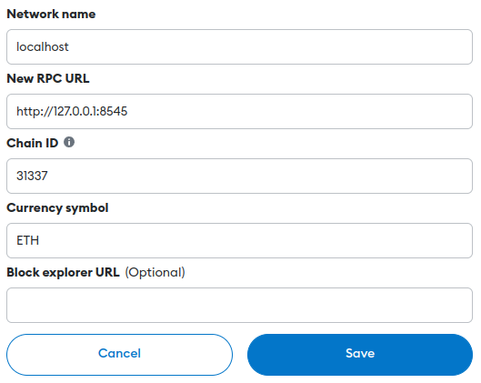

# PolyTechToken to IDO
This repository contains a minimal set of ready-made files to conduct the initial token deployment. This variant has its own fundraising page and corresponding contracts: token and its IDO.

## Launch rules
Before you can use it, you need to install the packages:
```json 
{
  "dependencies": {
    "@babel/core": "^7.23.2",
    "@openzeppelin/contracts": "^5.0.0",
    "bootstrap": "^5.3.2",
    "browserify": "^17.0.0",
    "ethers": "^5.5.3",
    "solc": "0.8.17",
    "watchify": "^4.0.0",
    "web3": "4.2.1"
  },
  "scripts": {
    "build": "browserify index.js --standalone bundle -o ./dist/bundle.js",
    "watch": "watchify index.js --standalone bundle -o ./dist/bundle.js -v"
  },
  "devDependencies": {
    "babelify": "^10.0.0",
    "http-server": "^14.1.0"
  }
}
```

After clone git repository you should follow this steps:
### Update dependencies
```bash
sudo apt-get update
sudo apt-get upgrade -y
```
### Go to directory
```bash
cd ptt_ido/
sudo apt-get install software-properties-common -y
```
### Add solidity repostory 
```bash
sudo add-apt-repository ppa:ethereum/ethereum
sudo apt-get update
```
### Install npm
```bash
sudo apt-get install npm -y
```
### Install nvm
```bash
curl -o- https://raw.githubusercontent.com/nvm-sh/nvm/v0.39.1/install.sh | bash
source ~/.bashrc
nvm install 16.20.2
nvm use 16.20.2
```
### Install Ganache
```bash
sudo npm install -g ganache
```
### Install yarn
```bash
sudo npm install --global yarn
```
### Install truffle
```bash
sudo npm install -g truffle
```
### Use yarn for install all packages
```bash
yarn install 
```

## How to use
### Back 
All things are happen in __develop__ network. For use another network, configurate `truffle-config.js`

In first terminal load local blockhain
```bash
ganache --chain.networkId 5777 --chain.chainId 31337 --server.host 127.0.0.1
```

Before deploy setup `deploy_param.js`:
```
{
    "INITIAL_OWNER_TOKEN_CONTRACT": 0,
    "TOTAL_SUPPLY": "78000000",

    "INITIAL_OWNER_IDO_CONTRACT": 0,
    "NUMBER_OF_TOKENS_TRANSFER": "100200",
    "RATE": "100000000000000",
    "START_TIME_IDO": 1699877123,
    "END_TIME_IDO": 1699891523
}
```
* Parameters for 2_deploy_token.js:
    - `INITIAL_OWNER_TOKEN_CONTRACT` - Owner account (by default the first in ganache)
    - `TOTAL_SUPPLY` - How many tokens to issue in total
* Parameters for 3_deploy_ido.js:
    - `NUMBER_OF_TOKENS_TRANSFER` - Number of tokens to be transferred to the IDO contract account (must be <= totalSupply)
    - `RATE` - Specified in [wei](https://www.investopedia.com/terms/w/wei.asp). In brief, how much ether must be given to get one token. [Convertor](https://eth-converter.com/) ether to wei.
    - `START_TIME_IDO` - Time when start IDO. In UNIX Time.
    - `END_TIME_IDO` - Time when end IDO. In UNIX Time.
    - `INITIAL_OWNER_IDO_CONTRACT` - _Extention_: you can change owner this contract

In the second terminal start migration
```bash
bash exec/migrate.bash
```

Now, in the second you can see that 2 contracts are deployed. From console:
  - Put contract address from section `3_deploy_ido.js` to file `index.js` in field `CONTRACT_ADDRESS_IDO`.
  - Put the IDO contract owner (_account_) from section `3_deploy_ido.js` to file `index.js` in field `OWNER_CONTRACT_ADDRESS_IDO`.
  - Put contract address frim section `2_seploy_token.js` to file `index.js` in field `CONTRACT_ADDRESS_TOKEN`.
  - _Extention_: setup `TOKEN_SYMBOL`, `TOKEN_DECIMAL`, `TOKEN_IMAGE` as you have done in Token.sol. If you've never change Token.sol - skip this point.

Here use build page
```bash
yarn build
```
Now up http-server
```bash
yarn http-server -p 8088
```
Go to http://127.0.0.1:8088 in your browser.

### Front (Metamask)
[Official meatamask guide: How to add a custom network RPC](https://support.metamask.io/hc/en-us/articles/360043227612-How-to-add-a-custom-network-RPC)

Go to Settings -> Networks -> Add a network -> click to Add a network manually


Then fill fields as photo down and save.



Import an account: [Official metamask guide](https://support.metamask.io/hc/en-us/articles/360015489331-How-to-import-an-Account)


## Use, edit, Rock and Roll!

## Possible errors
If there are errors in the _node_modules/openzippelin/.._. in `sol` type files, follow these errors and change the current version (most likely there is `pragma solidity ^0.8.20` or `^0.8.21`) on `pragma solidity ^0.8.17`;

Change in this files:
* @openzeppelin/contracts/token/ERC20/ERC20.sol
  * pragma solidity ^0.8.20; -> pragma solidity ^0.8.17;
  * mapping(address account => uint256) private _balances; -> mapping(address => uint256) private _balances;
  * mapping(address account => mapping(address spender => uint256)) private _allowances; -> mapping(address => mapping(address => uint256)) private _allowances;

* @openzeppelin/contracts/token/ERC20/IERC20.sol
  * pragma solidity ^0.8.20; -> pragma solidity ^0.8.17;

*@openzeppelin/contracts/utils/Context.sol
  * pragma solidity ^0.8.20; -> pragma solidity ^0.8.17;

* @openzeppelin/contracts/token/ERC20/extensions/IERC20Metadata.sol
  * pragma solidity ^0.8.20; -> pragma solidity ^0.8.17;

* @openzeppelin/contracts/interfaces/draft-IERC6093.sol
  * pragma solidity ^0.8.20; -> pragma solidity ^0.8.17;

* @openzeppelin/contracts/access/Ownable.sol
  * pragma solidity ^0.8.20; -> pragma solidity ^0.8.17;